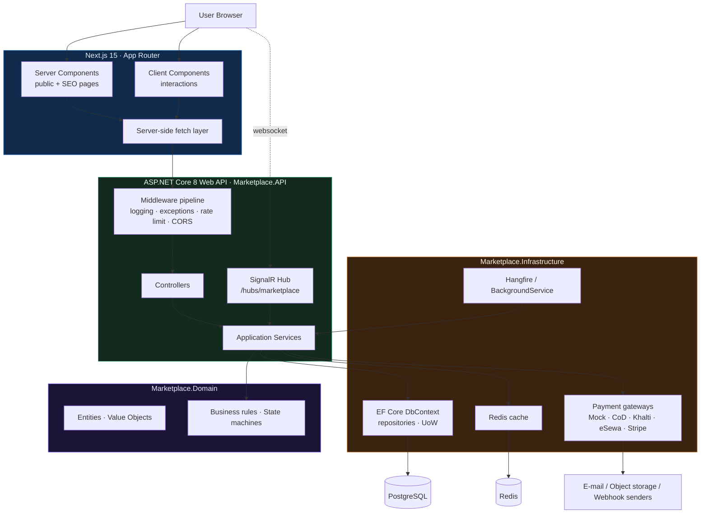
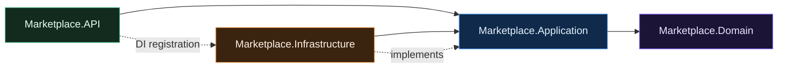
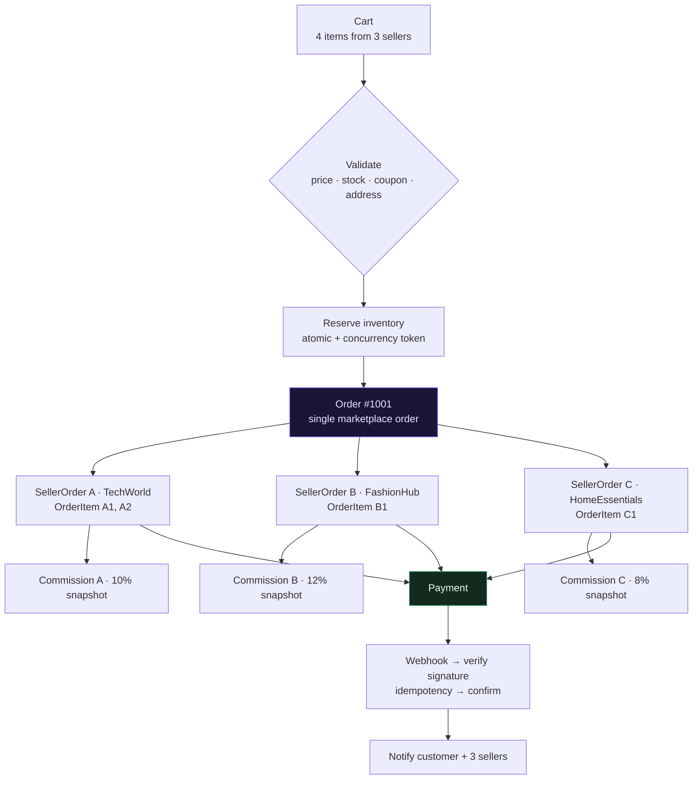
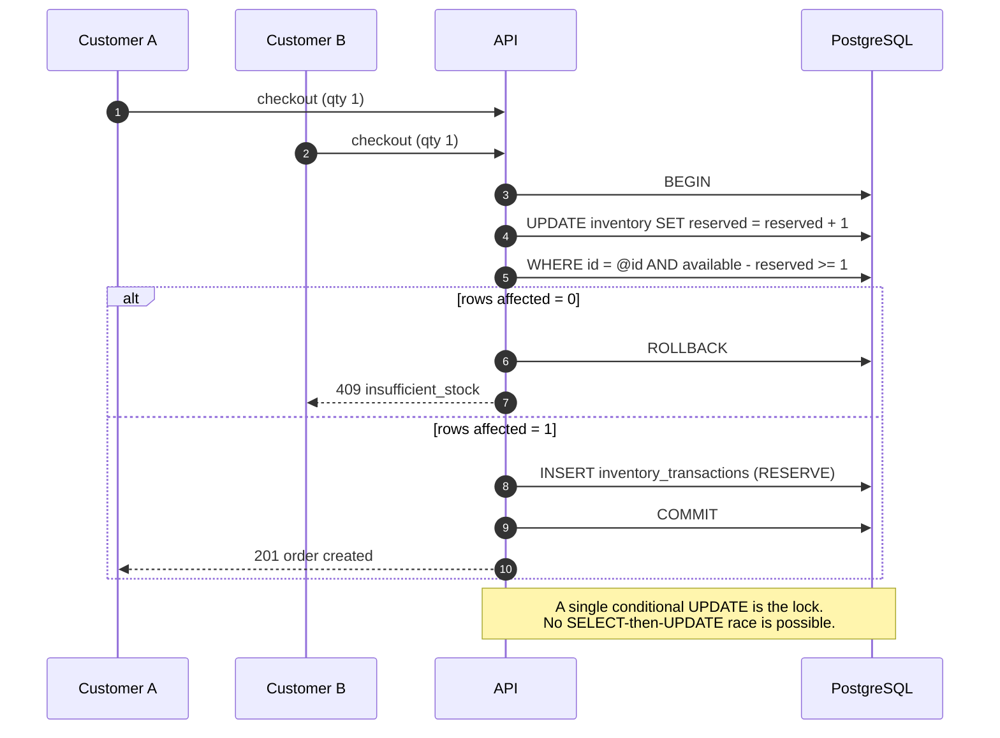
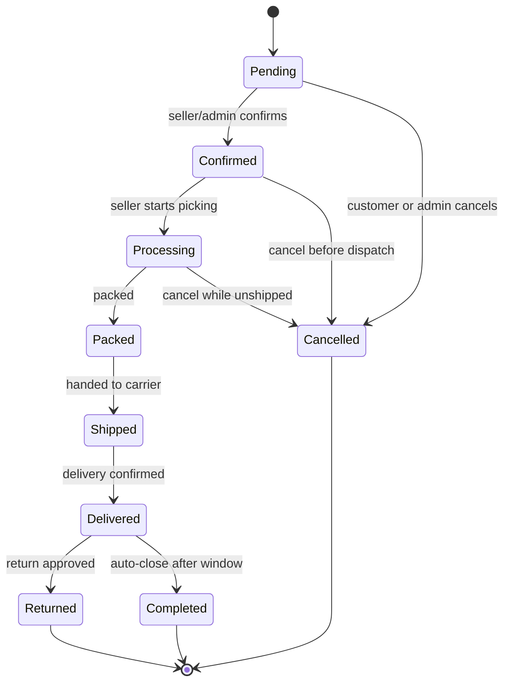
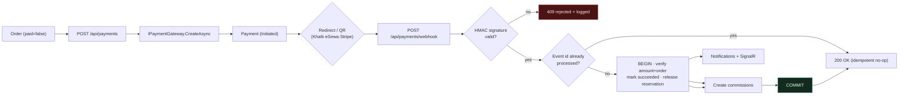
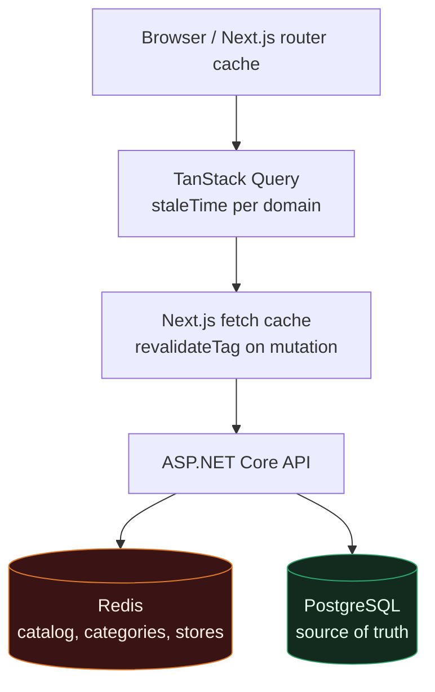

# Architecture Diagrams

## 1. Container diagram

## 2. Clean Architecture dependency rule

The Domain has **no NuGet package references**. A unit test fails the build if that ever changes.

## 3. Multi-seller order split

## 4. Inventory concurrency

## 5. Order state machine

`Completed`, `Cancelled` and `Returned` are terminal. Illegal transitions throw `InvalidOrderStateTransitionException` and are also rejected by the FluentValidation rule on `UpdateOrderStatusRequest`.

## 6. Payment & refund flow

Refund path: customer request → admin review → approve → gateway refund → payment refunded → inventory returned → order state updated → both parties notified. Rejected refunds record a mandatory reason and stay auditable.

## 7. Multi-layer caching

Financial and stock state is never served from any cache layer above PostgreSQL.
