# Database Design

> PostgreSQL 16 · EF Core 8 · Code First · Fluent API · `decimal(18,2)` money · `Guid` keys · `DateTimeOffset` UTC.

## 1. Conventions

| Concern | Convention |
| --- | --- |
| Primary key | `Guid` generated in the domain (time-ordered v7 layout) |
| Money | `numeric(18,2)` mapped to C# `decimal` — never floating point |
| Quantity | `int` with a `CHECK (quantity > 0)` constraint where positive |
| Timestamps | `timestamptz` mapped to `DateTimeOffset`, always UTC, always via `IClock` |
| Optimistic concurrency | `byte[] RowVersion` → PostgreSQL `xmax` on every mutable aggregate root |
| Soft delete | `is_deleted boolean` + `deleted_at timestamptz` on catalogue entities, with a global EF query filter |
| Enums | Stored as `string` (readable, migration-safe) via `HasConversion<string>()` |
| JSON columns | `jsonb` used only for audit before/after snapshots and webhook raw payloads |
| Naming | `snake_case` table and column names, PascalCase C# properties, no EF default `IX_` clutter in queries |
| Indexes | Named `ix_{table}_{columns}`; unique indexes for every natural key (slug, SKU, email, coupon code) |
| Foreign keys | `RESTRICT` on referenced business data, `CASCADE` only for owned child rows (order items, cart items) |

## 2. Entity relationship diagram

```mermaid
erDiagram
    USERS ||--o{ REFRESH_TOKENS : "has"
    USERS ||--o| SELLERS : "applies as"
    USERS ||--o{ USER_ADDRESSES : "has"
    USERS ||--o{ NOTIFICATIONS : "receives"
    USERS ||--o| CARTS : "owns"
    USERS ||--o{ WISHLISTS : "owns"
    USERS ||--o{ AUDIT_LOGS : "performs"
    USERS ||--o{ ORDERS : "places"
    USERS ||--o{ REVIEWS : "writes"

    SELLERS ||--|| SELLER_STORES : "operates"
    SELLERS ||--o{ PRODUCTS : "lists"
    SELLERS ||--o{ SELLER_ORDERS : "fulfils"
    SELLERS ||--o{ COMMISSIONS : "earns"
    SELLERS ||--o{ COUPONS : "creates"
    SELLERS ||--o{ SELLER_PAYOUTS : "receives"
    SELLERS ||--o{ INVENTORY_TRANSACTIONS : "performs"

    CATEGORIES ||--o{ CATEGORIES : "parent of"
    CATEGORIES ||--o{ PRODUCTS : "classifies"
    CATEGORIES ||--o{ COUPON_PRODUCTS : "scopes"

    PRODUCTS ||--o{ PRODUCT_IMAGES : "shows"
    PRODUCTS ||--o{ PRODUCT_VARIANTS : "offers"
    PRODUCTS ||--o{ PRODUCT_TAGS : "labelled"
    PRODUCTS ||--o{ PRODUCT_SPECIFICATIONS : "describes"
    PRODUCTS ||--o{ REVIEWS : "reviewed by"
    PRODUCTS ||--o{ COUPON_PRODUCTS : "scoped by"
    PRODUCT_VARIANTS ||--|| INVENTORY : "stocked by"
    INVENTORY ||--o{ INVENTORY_TRANSACTIONS : "audited by"

    CARTS ||--o{ CART_ITEMS : "contains"
    WISHLISTS ||--o{ WISHLIST_ITEMS : "contains"

    ORDERS ||--o{ SELLER_ORDERS : "splits into"
    ORDERS ||--o{ ORDER_ITEMS : "contains"
    ORDERS ||--o{ PAYMENTS : "paid by"
    ORDERS ||--o{ REFUNDS : "refunded via"
    ORDERS }o--|| USER_ADDRESSES : "ships to"
    ORDERS }o--|| COUPONS : "discounted by"
    SELLER_ORDERS ||--o{ ORDER_ITEMS : "contains"
    SELLER_ORDERS ||--o| COMMISSIONS : "generates"

    PAYMENTS ||--o{ PAYMENT_TRANSACTIONS : "records"
    PAYMENTS ||--o{ PAYMENT_WEBHOOKS : "receives"
    PAYMENTS ||--o{ REFUNDS : "refunded by"
    REFUNDS ||--o{ REFUND_ITEMS : "covers"

    COUPONS ||--o{ COUPON_PRODUCTS : "applies to"
    COUPONS ||--o{ COUPON_USAGES : "consumed by"
    TAGS ||--o{ PRODUCT_TAGS : "assigned to"

    USERS {
        uuid id PK
        string email UK
        string password_hash
        string first_name
        string last_name
        string phone
        string role
        bool email_confirmed
        datetime last_login_at
        bytea row_version
    }
    SELLERS {
        uuid id PK
        uuid user_id FK
        string status
        string business_name
        decimal commission_rate
        text rejection_reason
        datetime approved_at
    }
    SELLER_STORES {
        uuid id PK
        uuid seller_id FK
        string slug UK
        string store_name
        text description
        string logo_url
        decimal rating_average
        int rating_count
        bool is_active
    }
    CATEGORIES {
        uuid id PK
        uuid parent_id FK
        string name
        string slug UK
        int display_order
        bool is_active
    }
    PRODUCTS {
        uuid id PK
        uuid seller_id FK
        uuid category_id FK
        string name
        string slug UK
        text description
        decimal base_price
        decimal compare_at_price
        string status
        bool is_featured
        int view_count
        bytea row_version
    }
    PRODUCT_VARIANTS {
        uuid id PK
        uuid product_id FK
        string sku UK
        decimal price
        int sort_order
        bool is_active
    }
    INVENTORY {
        uuid id PK
        uuid product_variant_id FK
        int available_quantity
        int reserved_quantity
        int sold_quantity
        int low_stock_threshold
        bytea row_version
    }
    INVENTORY_TRANSACTIONS {
        uuid id PK
        uuid inventory_id FK
        uuid seller_id FK
        string type
        int quantity_delta
        int quantity_before
        int quantity_after
        string reference_type
        uuid reference_id
    }
    CARTS {
        uuid id PK
        uuid user_id FK
        string guest_token UK
        datetime last_activity_at
    }
    CART_ITEMS {
        uuid id PK
        uuid cart_id FK
        uuid product_id FK
        uuid product_variant_id FK
        int quantity
        decimal unit_price
        bool saved_for_later
    }
    ORDERS {
        uuid id PK
        string order_number UK
        uuid customer_id FK
        uuid shipping_address_id FK
        uuid coupon_id FK
        string status
        decimal subtotal
        decimal discount_amount
        decimal shipping_amount
        decimal tax_amount
        decimal total_amount
        datetime placed_at
        bytea row_version
    }
    SELLER_ORDERS {
        uuid id PK
        uuid order_id FK
        uuid seller_id FK
        string seller_order_number UK
        string status
        decimal subtotal
        decimal commission_rate
        decimal commission_amount
        decimal seller_earnings
    }
    ORDER_ITEMS {
        uuid id PK
        uuid order_id FK
        uuid seller_order_id FK
        uuid product_id FK
        uuid product_variant_id FK
        string product_name
        string product_image
        int quantity
        decimal unit_price
        decimal line_total
        bool is_reviewed
    }
    PAYMENTS {
        uuid id PK
        uuid order_id FK
        string provider
        string provider_reference
        decimal amount
        string status
        string failure_reason
        datetime initiated_at
        datetime completed_at
    }
    PAYMENT_TRANSACTIONS {
        uuid id PK
        uuid payment_id FK
        string type
        string request_payload jsonb
        string response_payload jsonb
        bool is_success
    }
    PAYMENT_WEBHOOKS {
        uuid id PK
        uuid payment_id FK
        string provider
        string provider_event_id UK
        string signature
        jsonb payload
        bool is_processed
        string failure_reason
    }
    REFUNDS {
        uuid id PK
        uuid order_id FK
        uuid payment_id FK
        uuid customer_id FK
        string status
        decimal amount
        text reason
        text review_note
    }
    COMMISSIONS {
        uuid id PK
        uuid seller_order_id FK
        uuid seller_id FK
        decimal rate
        decimal gross_amount
        decimal commission_amount
        decimal seller_amount
        string status
    }
    REVIEWS {
        uuid id PK
        uuid product_id FK
        uuid order_item_id FK
        uuid customer_id FK
        int rating
        string title
        text body
        bool is_visible
    }
    COUPONS {
        uuid id PK
        uuid seller_id FK
        string code UK
        string discount_type
        decimal discount_value
        decimal minimum_order_amount
        decimal maximum_discount_amount
        int usage_limit
        int usage_count
        int per_user_limit
        datetime starts_at
        datetime ends_at
        bool is_active
    }
    NOTIFICATIONS {
        uuid id PK
        uuid user_id FK
        string type
        string title
        text body
        string link
        bool is_read
    }
    AUDIT_LOGS {
        uuid id PK
        uuid actor_id FK
        string action
        string entity_type
        uuid entity_id
        jsonb changes
        string ip_address
        string correlation_id
    }
    SELLER_PAYOUTS {
        uuid id PK
        uuid seller_id FK
        decimal gross_amount
        decimal commission_amount
        decimal net_amount
        string status
        datetime period_start
        datetime period_end
    }
```



## 3. Aggregate boundaries

```text
Seller aggregate          Seller + SellerStore
Product aggregate         Product + ProductImage + ProductVariant + Tag links
                          + Specification + rating aggregates
Inventory aggregate       Inventory + InventoryTransaction (append-only ledger)
Cart aggregate            Cart + CartItem + Wishlist + WishlistItem
Order aggregate           Order + SellerOrder + OrderItem   (one ACID boundary)
                          + Payment + PaymentTransaction
                          + Refund + RefundItem + Commission
```

The **order aggregate is the transaction boundary for checkout**. A single `SaveChangesAsync` inside an explicit transaction commits reservations, the marketplace order, all seller sub-orders, every order item, the payment row and every commission, or none of them.

## 4. Critical indexes

```sql
-- catalogue
CREATE UNIQUE INDEX ux_products_slug                ON products (slug) WHERE NOT is_deleted;
CREATE INDEX        ix_products_seller_status       ON products (seller_id, status, created_at DESC);
CREATE INDEX        ix_products_category_status     ON products (category_id, status, created_at DESC);
CREATE INDEX        ix_products_price               ON products (base_price);
CREATE INDEX        ix_products_featured            ON products (is_featured, created_at DESC) WHERE is_featured;
CREATE INDEX        ix_products_search_trgm         ON products USING gin (to_tsvector('english',
                          name || ' ' || coalesce(description, '')));

-- variants & inventory
CREATE UNIQUE INDEX ux_product_variants_sku         ON product_variants (sku);
CREATE UNIQUE INDEX ux_inventory_variant            ON inventory (product_variant_id);
CREATE INDEX        ix_inventory_low_stock          ON inventory (available_quantity - reserved_quantity)
                                                    WHERE available_quantity - reserved_quantity <= low_stock_threshold;

-- orders
CREATE UNIQUE INDEX ux_orders_number                ON orders (order_number);
CREATE INDEX        ix_orders_customer_created      ON orders (customer_id, placed_at DESC);
CREATE INDEX        ix_orders_status_placed        ON orders (status, placed_at DESC);
CREATE INDEX        ix_seller_orders_seller_status  ON seller_orders (seller_id, status, created_at DESC);
CREATE INDEX        ix_seller_orders_order          ON seller_orders (order_id);

-- payments
CREATE UNIQUE INDEX ux_payments_provider_reference  ON payments (provider, provider_reference);
CREATE UNIQUE INDEX ux_payment_webhooks_event       ON payment_webhooks (provider, provider_event_id);

-- money-side reporting
CREATE INDEX        ix_commissions_seller_status    ON commissions (seller_id, status, created_at DESC);
CREATE INDEX        ix_refunds_status_created       ON refunds (status, created_at DESC);

-- engagement
CREATE INDEX        ix_reviews_product_visible      ON reviews (product_id, created_at DESC) WHERE is_visible;
CREATE UNIQUE INDEX ux_reviews_order_item           ON reviews (order_item_id);
CREATE INDEX        ix_notifications_user_unread     ON notifications (user_id, is_read, created_at DESC);

-- audit & auth
CREATE INDEX        ix_audit_logs_actor_created     ON audit_logs (actor_id, created_at DESC);
CREATE INDEX        ix_audit_logs_entity            ON audit_logs (entity_type, entity_id);
CREATE UNIQUE INDEX ux_users_email_lower           ON users (lower(email));
CREATE UNIQUE INDEX ux_refresh_tokens_hash         ON refresh_tokens (token_hash);
```

## 5. Transaction & isolation strategy

| Operation | Isolation | Guard |
| --- | --- | --- |
| Inventory reserve | `ReadCommitted` + conditional `UPDATE` | `WHERE available_quantity - reserved_quantity >= @qty` + `RowVersion` |
| Checkout | `ReadCommitted`, explicit `BeginTransactionAsync` | all writes commit atomically |
| Commission create | inside the checkout transaction | derived from the seller-order subtotal |
| Refund approval | explicit transaction | `refunds.status` conditional update prevents double processing |
| Webhook processing | `ReadCommitted` + unique index on `(provider, provider_event_id)` | duplicate insert throws → acknowledged as a no-op |
| Product approval | `RowVersion` | concurrent admin edits produce `DbUpdateConcurrencyException` → `409` |

Isolation stays at the PostgreSQL default (`READ COMMITTED`) because correctness comes from **conditional writes and unique constraints**, not from escalating to `SERIALIZABLE` — which would inflate lock volume and deadlock risk under burst traffic.

## 6. Data retention

| Data | Policy |
| --- | --- |
| Expired refresh tokens | deleted after 7 days past expiry by `TemporaryRecordCleanupJob` |
| Consumed webhooks | retained 90 days (fraud/chargeback evidence), then purged |
| Abandoned carts | cleared after 30 days of inactivity |
| Audit logs | retained indefinitely (compliance), archived yearly |
| Soft-deleted products/categories | restorable for 90 days, then hard-deleted |
| Notifications | read notifications older than 12 months are purged |
